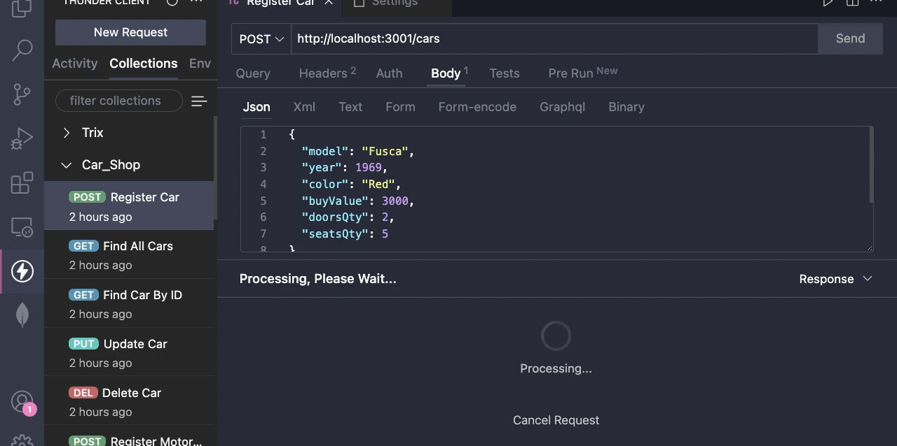

</img>

# Car Shop API

## Projeto realizado durante o curso da Trybe no módulo de back-end, para estudo de `Mongoose` e `POO`.
<br>

Trata-se de uma API com `CRUD` (Create, Read, Update, Delete), construída com os princípios de Programação Orientada a Objetos `(POO)`, para gerenciar uma concessionária de veículos. Foi projetada utilizando o banco de dados `MongoDB`, através do framework do `Mongoose`.

Nela, é possível cadastrar, ler, atualizar e excluir carros e motocicletas do banco de dados, através de requisições http.

O projeto conta com testes de unidade cobrindo 100% da camada Service, utilizando Mocha.

Os arquivos criados por mim encontram-se dentro das pastas /src e /tests. O resto do projeto, incluindo a configuração docker, foi provido pela Trybe para facilitar a inicialização.

</details>

<br>

## Rodando a aplicação localmente via Docker

- Clone o repositório:
  
```bash
  git clone git@github.com:mathlaza/backend-Car-Shop.git
```
- Entre no diretório do repositório:
  
```bash
  cd backend-Car-Shop
```

- Instale as dependências:
  
```bash
  npm install
```

- Inicie os contêineres via Docker Compose:
  
```bash
  docker-compose up -d
```

> 👀 Observação: Dois contêineres irão subir! Um para a aplicação Node TypeScript, denominado `car_shop` e outro para o banco de dados MongoDB, denominado `car_shop_db`

- Para acessar o contêiner do banco de dados, basta executar comando abaixo:

  ```bash
    docker exec -it car_shop_db mongo
  ```

  > 👀 Observação: Aqui você pode executar comandos como: `show dbs`, `use #COLLECTION_NAME`, `show collections` e etc...

<br>

- Para acessar o contêiner da aplicação, basta executar comando abaixo:

```bash
  docker exec -it car_shop bash
```
- Após acessar o contêiner da aplicação, para subir o servidor, execute:

  ```bash
    npm run dev
  ```
  > 👀 Observação: Com o servidor rodando, você já pode realizar requisições com o `Thunder Client`, por exemplo!

- Para rodar os testes de unidade, execute:

  ```bash
    npm run test:mocha
  ```
- Para verificar a cobertura de testes da aplicação, execute:

  ```bash
    npm run test:coverage
  ```

<br>
<hr>

## Lista de endpoints

> ⚠️ Dica: Há uma coleção dos endpoints em formato JSON para importação na extensão [Thunder Client](https://marketplace.visualstudio.com/items?itemName=rangav.vscode-thunder-client) do VS Code no arquivo `thunder_Car_Shop.json`

<details>
  <summary>Como importar a coleção no Thunder Client</summary>

  1. Abra a aba da extensão Thunder Client;
  2. Clique na aba Collections;
  3. Clique no menu de opções;
  4. Clique em Import;
  5. Escolha o arquivo `thunder_Car_Shop.json`;
  6. Clique em OK.

</details>

<br>

### Resumo das rotas de carros:

  - POST `/cars  ---->  (Registra um novo carro)`;
  - GET `/cars  ---->  (Retorna todos os carros)`;
  - GET `/cars/:id  ---->  (Retorna um carro pelo id)`;
  - PUT `/cars/:id  ---->  (Atualiza um carro pelo id)`;
  - DELETE `/cars/:id  ---->  (Deleta um carro pelo id)`;

<br>

### Resumo das rotas de motocicletas:

  - POST `/cars  ---->  (Registra uma nova moto)`;
  - GET `/cars  ---->  (Retorna todas as motos)`;
  - GET `/cars/:id  ---->  (Retorna uma moto pelo id)`;
  - PUT `/cars/:id  ---->  (Atualiza uma moto pelo id)`;
  - DELETE `/cars/:id  ---->  (Deleta uma moto pelo id)`;

  <br>
  <hr>

## Tecnologias utilizadas

Essas foram as ferramentas utilizadas durante o desenvolvimento do projeto:
* <span style="color:#58a6ff">MongoDB</span>
* <span style="color:#58a6ff">Mongoose</span>
* <span style="color:#58a6ff">Typescript</span>
* <span style="color:#58a6ff">Express</span>
* <span style="color:#58a6ff">Mocha, Chai, Sinon</span>
